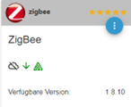
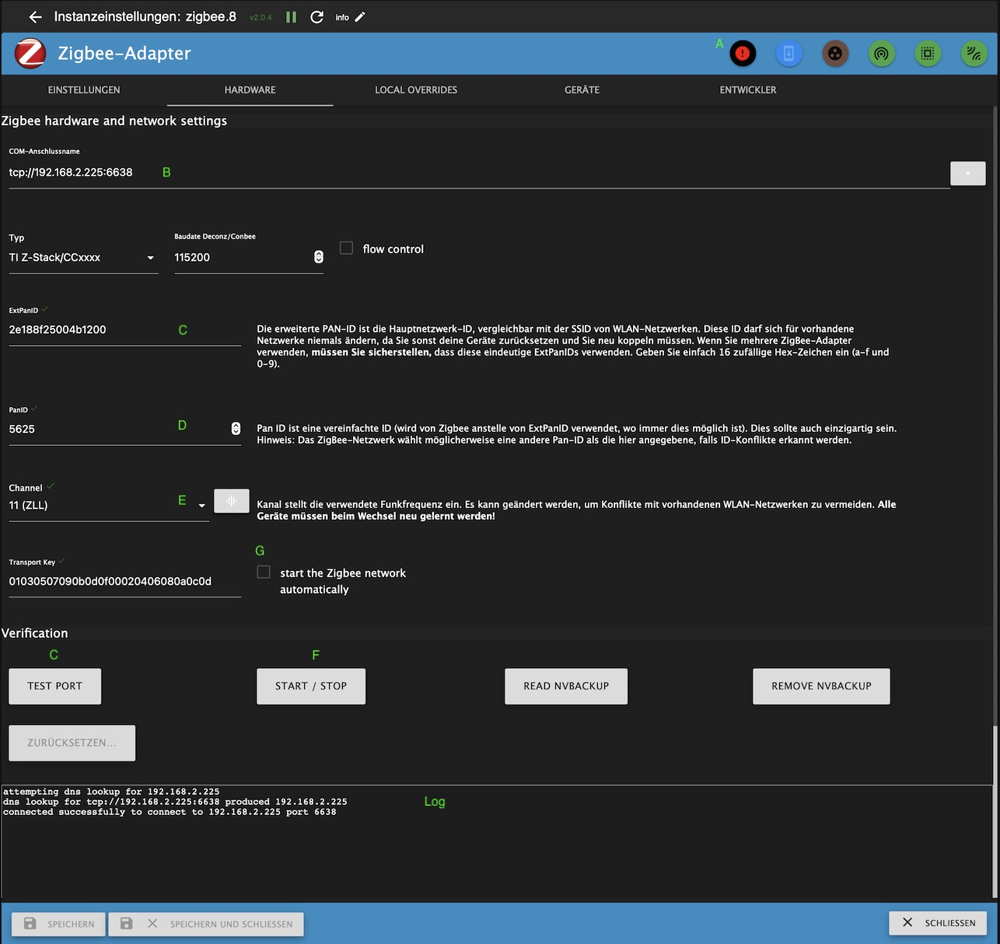
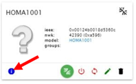

# ioBroker Adapter für Zigbee-Geräte
Mit Hilfe eines Koordinators für ZigBee-Netze, basierend auf dem Chip "Texas Instruments CC253x" (und anderen), wird ein eigenes ZigBee-Netz erschaffen, dem ZigBee-Geräte (Lampen, Dimmer, Sensoren, …) beitreten können. Dank der direkten Interaktion mit dem Koordinator erlaubt der ZigBee-Adapter die Steuerung der Geräte ohne jegliche Gateways/Bridges der Hersteller (Xiaomi/Tradfri/Hue). Zusätzliche Informationen zu ZigBee kann man hier [hier nachlesen (Englisch)](https://github.com/Koenkk/zigbee2mqtt/wiki/ZigBee-network).

## Die Hardware
Für den Koordinator (siehe oben) ist eine zusätzliche Hardware erforderlich, welche die Umsetzung zwischen USB und ZigBee-Funksignalen ermöglicht. Es gibt 3 Arten von Koordinatoren:

   - Aufsteckmodule für den RaspberryPi (Die Nutzung dieser Module wird **nicht** empfohlen.) 
   - Per USB angeschlossene Module, entweder in Form von Entwicklungsboards oder USB-Sticks
   - Netzwerk Koordinatoren

Eine vollständige Liste der kompatiblen Koordinatoren (auf englisch) ist [hier](https://www.zigbee2mqtt.io/guide/adapters/) zu finden. Wir empfehlen ausschliesslich den Einsatz von als 'recommended' gelisteten Koordinatoren. An gleicher Stelle finden sich auch Anleitungen zum aufspielen der benötigen Firmware.

Koordinatoren werden auch mit bereits aufgespielter Firmware verkauft. Dabei gilt: **jeder Koordinator dessen Firmware mit Zigbee2mqtt.io kompatibel ist kann auch mit dem Zigbee Adapter verwendet werden**.

Aktuell (Stand März 2025) sind insbesondere "Sonoff ZIGBEE 3.0 USB-STICK CC2652P" (Sowohl in der Variante mit CC2652P als auch mit EZSP Chipsatz) sowie Netzwerk-Koordinatoren mit Cod.m und/oder XTG Firmware beliebt. Auch der Conbee II und Conbee III werden oft eingesetzt. Vom Einsatz der TI Koordinatoren mit CC2530/CC2531 wird dringend abgeraten - diese gelten inzwischen als veraltet.

Die mit dem ZigBee-Netz verbundenen Geräte übermitteln dem Koordinator ihren Zustand und benachrichtigen über Ereignisse (Knopfdruck, Bewegungserkennung, Temperaturänderung, …). Diese Infos werden im Adapter unter den jeweiligen ioBroker-Objekten angezeigt und können so in ioBroker weiterverarbeitet werden. Außerdem ist es möglich Kommandos an das ZigBee-Gerät zu senden (Zustandsänderung Steckdosen und Lampen, Farb- und Helligkeitseinstellungen, …).

## Die Software

Die Software wird unterteilt in "Konverter" und "Adapter".

   - Konverter  
    Der Konverter gliedert sich auf in zwei Teile:  
    a) Allgemeine Bereitstellung der Daten aus den ZigBee-Funksignalen. Dieser [Softwareteil](https://github.com/Koenkk/zigbee-herdsman) wird für alle ZigBee-Geräte verwendet.   
    b) Gerätespezifische [Aufbereitung](https://github.com/Koenkk/zigbee-herdsman-converters) der Daten auf eine definierte Schnittstelle zum Adapter.  

   - Adapter  
    Dieser Softwareteil ist die Anbindung des Konverters an ioBroker. Der [Adapter](https://github.com/ioBroker/ioBroker.zigbee) beinhaltet die grafische Darstellung zur Verwaltung der ZigBee-Geräte, sowie die Erzeugung der ioBroker-Objekte zur Steuerung der ZigBee-Geräte.

## Installation
1.	Koordinator Hardware am RaspberryPi anstecken. 
2.	Über z.B. PuTTY mit RaspberryPi verbinden. 
3.	Eventuell vorhandene ZigBee-Backupdatei löschen. Andernfalls wird der ZigBee-Adapter in ioBroker nicht grün und im ioBroker Log steht, dass der Adapter falsch konfiguriert ist. 
sudo rm /opt/iobroker/iobroker-data/zigbee_0/nvbackup.json 
4.	Pfad des Koordinators ermitteln. Auf Linux Systemen befindet sich dieser oft im Verzeichnis /dev/serial/by-id. Alternativ dazu werden /dev/ttyUSB*, /dev/ttyAM* (Linux), /dev/tty.usbserial-* (macOS) oder com* (windows) erwartet. 
Das folgende Beispiel zeigt eine Linux-Installation auf einem Raspberry PI. Der Befehl `ls -la /dev/serial/by-id/` erzeugt die im Bild erkennbare Ausgabe.

6.	ioBroker -> ZigBee-Adapter installieren, hier als Beispiel die Version 1.8.10       Hiermit werden alle erforderlichen Softwareteile (Konverter und Adapter) installiert.
7. Konfiguration des Adapters öffnen. Das folgende Bild zeigt das Interface ab der Version 2.1.0.  
Der Admin zeigt in dieser Situation an ob das Zigbee-Subsystem gestartet ist (A).
8. Port zum Koordinator eintragen. (B) Im Fall von USB Koordinatoren ist das der zuvor ermittelte Device-Pfad. Im Fall von über das Netzwerk angesteuerten Koordinatoren muss an Stelle des Gerätepfades die Netzwerkaddresse samt port in der Form tcp://ip:port angegeben werden. Sofern der Adapter selber (nicht das Zigbee-Subsyste) aktiv ist steht eine Liste der verfügbaren seriellen Schnittstellen zur Auswahl zur Verfügung. Bei der Auswahl gilt:
- Sofern am System mehrere Adapter mit unterschiedlichen USB Geräten zur Kommunikation verwendet werden sollte **unbedingt** ein Port aus dem Verzeichnis /dev/serial/by-id (sofern verfügbar) ausgewählt werden. Damit wird sicher gestellt das bei einem Neustart des Systems die Zuordnung des Adapters zum Koordinator erhalte bleibt
- Sofern ausschliesslich ein USB Gerät verwendet wird ist die Verwendung des /dev/TTY* Anschlusses zu bevorzugen. Damit kann der Koordinator bei Defekt durch ein baugleiches Gerät ersetzt werden ohne das die Konfiguration angepasst werden muss.
8.	Netzwerk-ID und Pan ID vergeben zur Unterscheidung von anderen ZigBee-Netzwerken in Funkreichweite, z.B. Ab Adapter Version 2.1.0 weden ExtPanID (C) und PanID (D) automatisch mit zufälligen Werten vorbelegt bis die Konfiguration gespeichert wurde. 
9. Geeigneten Zigbee-Kanal (E) auswählen. Dabei ist zu beachten das Zigbee und 2.4GHz WLAN sich das gleiche Frequenzband teilen. Der optimale Kanal hängt also unter anderem auch von den in der Umgebung verwendeten WLan Kanälen ab. Dabei sind die Kanalbezeichnungen von Zigbee und WLan **nicht** identisch. Weiterhin ist es Sinnvoll sich bei der Auswahl auf die Zigbee Light Link (ZLL) Kanäle zu beschränken. Sofern der Adapter erfolgreich gestartet wurde kann über die Konfiguration auch ein Scan der Netzwerkkanäle durchgeführt werden. Ab Adapter Version 2.1.0 ist es Möglich den Kanal zu wechseln ohne das die Konfiguration gelöscht und alle Geräte neu angelernt werden müssen. Diese Funktion ist aber als Experimentell zu betrachten - es kann sein das einzelne Geräte den Kanalwechsel nicht mit machen - diese müssen in der Folge neu angelernt werden.
10.	Prüfen ob das Zigbee-Subsystem startet. Dazu via *Start/Stop* (F) versuchen das Zigbee-Subsystem zu starten. Im Log (Log) kann der Verlauf des Startversuchs beobachtet werden. Das Icon (A) ändert seine Farbe von Schwarz/Rot auf Schwarz/Orange während der Herdsman startet. Wenn der Versuch erfolgreich war erlischt das Icon komplett, ansonsten wird es wieder Rot und die Meldungen im Log geben Hinweise auf die Ursache. 
Über die gleiche Schaltfläche kann der Herdsman auch angehalten werden. Auch dabei wird das Icon in Schwarz/Orange dargestellt. **Wichtig: Das Anhalten kann in einzelfǎllen bis zu 2 Minuten dauern - insbesondere bei der Verwendung von Netzwerk Koordinatoren.** Hier ist Geduld gefragt. Nachdem der Herdsman beendet wurde erscheint das Icon in Schwarz/Rot und die Meldung 'Herdsman stopped!'.
Je nach Fehlerbild gibt es verschiedene mögliche Ursachen dafür das der Herdsman nicht startet. Sofern es sich dabei 'nur' um eine Zeitüberschreitung (Timeout) handelt ist es durchaus Sinnvoll den Versuch direkt zu widerholen. Bei inkonsistenter Konfiguration werden die relevanten Daten im Log angezeigt. Hier bietet der Adapter zwei Möglichkeiten den Konflikt zu lösen:
- Lesen der Daten aus dem NVBackup. In diesem Fall wird die Konfiguration des Adapters angepasst.
- Löschen des NVBackups. In diesem Fall bleibt die Konfiguration im Adapter wie sie ist. Dieses **erzwingt** einen Neuaufbau des Netzwerkes so das in der Folge alle bereits angelernten Geräte zurückgesetzt und neu angelernt werden müssen. 
Die Ausgaben im Log sind auch dazu geeignet bei der Suche nach einer Lösung im [ioBroker Forum](https://forum.iobroker.net) eingesetzt zu werden. Dazu bitte die Meldungen markieren und **als Text** im Forum posten.

## Pairing
Jedes ZigBee-Gerät (Schalter, Lampe, Sensor, …) muss mit dem Koordinator gekoppelt werden (Pairing):   

   - ZigBee-Gerät:
    Jedes **ZigBee-Gerät** kann nur mit genau 1 ZigBee-Netzwerk verbunden sein. Hat das ZigBee-Gerät noch Pairing-Informationen zu einem fremden Koordinator (z.B. Philips Hue Bridge) gespeichert, dann muss es von diesem ZigBee-Netzwerk zuerst entkoppelt werden. Dieses Entkoppeln vom alten ZigBee-Netzwerk erfolgt vorzugsweise über die Bedienoberfläche des alten ZigBee-Netzwerkes (z.B. Philips Hue App). Alternativ kann man das ZigBee-Gerät auf Werkseinstellungen zurücksetzen.   
    Um ein ZigBee-Gerät nun in den Pairing-Mode zu versetzen, gibt es typischerweise folgende Möglichkeiten:  
        1.	ZigBee-Gerät von einem ZigBee-Netzwerk entkoppeln
        2.	Pairing-Button am ZigBee-Gerät drücken (ggf. mehrfach)
        3.	Versorgungsspannung des ZigBee-Gerätes aus- und dann wieder einschalten  (ggf. mehrfach)

Danach ist das ZigBee-Gerät für typischerweise 60 Sekunden im Pairing-Mode.  
Ähnlich wie die Vorgehensweise zum Rücksetzen auf Werkseinstellungen ist auch das Aktivieren des Pairing-Mode abhängig vom jeweiligen Gerätetyp (ggf. Bedienungsanleitung des ZigBee-Gerätes lesen).   

   - Koordinator:
Grünen Knopf drücken, um den Koordinator für 60 Sekunden (oder die in den Adaptereinstellungen gewählte Zeit) in den Pairing-Mode zu versetzen.  

   - Warten bis im Dialog `Interview Successful` erscheint: 

   - Pairing überprüfen:
Das zu koppelnde Gerät muss vom ioBroker ZigBee-Adapter unterstützt werden. Im Gutfall wird im ZigBee-Adapter ein neues Gerät angezeigt (z.B. Philips Light Stripe) mit dem Hinweis `"supported":true` und entsprechende ioBroker-Objekte angelegt: 
 

   - Im Schlechtfall wird das ZigBee-Gerät aktuell noch nicht unterstützt. Im nächsten Abschnitt ist beschrieben, was zu tun ist, um dieses ZigBee-Gerät dennoch nutzen zu können.

## Pairing von bisher unbekannten ZigBee-Geräten

Bei bisher unbekannten ZigBee-Geräten erscheint beim Pairing der ZigBee-Name des ZigBee-Gerätes (z.B. HOMA1001) mit dem Zusatz `"supported": false`  
  

Durch Drehen dieser Kachel erhält man Detailinformationen zu dem ZigBee-Gerät:  
   

Nach einer Registrierung bei [github.com](https://github.com/ioBroker/ioBroker.zigbee/issues) kann über einen "Issue" das fehlende ZigBee-Gerät gemeldet werden:

  

Detailinformationen der Kachel (siehe oben) in dem Issue einfügen, erstelle eine kurze Dokumentation (vorzugweise auf Englisch) und absenden. Ein Entwickler wird sich daraufhin über den Issue melden.

Als Ergebnis kommt eine von zwei Möglichkeiten in Frage:
- Anpassung an den Zigbee-Herdsman-Converters. Dieses erfordert eine aktualiserte Version des Zigbee-Adapters, der zunächst getestet und dann im Latest Repository zur Verfügung gestellt wird
- Erstellung eines "externen Konverters" - einer Datei mit JS Code welche in das Datenverzeichnis des Zigbee-Adapters kopiert und in der Konfiguration des Adapters angegeben werden kann.
In Beiden Fällen ist es hinreichend den Adapter neu zu starten - die entsprechend angepassten Datenpunkte des Adapters werden angelegt. Sofern dabei Datenpunkte nicht weiter unterstützt werden so werden diese in orange eingefärbt und der Adapter zeigt die Schaltfläche zum löschen der verwaisten Datenpunkte an.

## Symbole im ZigBee-Adapter

| Bild                | Beschreibung                                                                                                                                                                                                                                                                                                                                                                                                                                                                                                                                                                                                                                                                                                 |
|---------------------|--------------------------------------------------------------------------------------------------------------------------------------------------------------------------------------------------------------------------------------------------------------------------------------------------------------------------------------------------------------------------------------------------------------------------------------------------------------------------------------------------------------------------------------------------------------------------------------------------------------------------------------------------------------------------------------------------------------|
|  | **State Cleanup**   Löschen von unverbundenen ioBroker-Objekten. Diese können  welche durch den Vorgang "Ausschliessen" entstehen können.                                                                                                                                                                                                                                                                                                                                                                                                                                                                                                                                                                                  |
|  | **Show stashed errors**   Anzeigen von gesammelten Fehlermeldungen die widerholt auftreten. Dieses Icon ist nur dann sichtbar wenn das System wiederkehrende Fehlermeldungen unterdrückt hat und dient dazu den Benutzer auf deren Existenz hin zu weisen.                                                                                                                                                                                                                                                                                                                                                                                                                                                                                                            |
|  | **Auf Firmware Updates überprüfen**   Der Zigbee Adapter ist unterstützt OTA Firmware upgrades, sofern die angeschlossenen Geräte dieses unterstützen. Mit dieser Schaltfläche wird die Überprüfung auf neuere Firmware angestossen - das eigentliche Upgrade miss in der Folge an jedem Gerät einzenl angestossen werden.                                                                                                                                                                                                                                                                                                                                                                                                                                                                                                                                                                                                  |
|  | **Add Group**   Die Zigbee-Spezifikation unterstützt das anlegen von Gruppen von Geräten, die gemeinsam über einen Befehl angesteuert werden könne. Während die Spezifikation fast b eliebige Befehle als Gruppenbefehle unterstützt ist die Umsetzung im Zigbee-Adapter auf Leuchtmittel begrenzt - Mit dieser Schaltfläche kann eine neue Gruppe angelegt werden. Das hinzufügen und entfernen von Mitgliedern geschieht über die Geräte / Gruppenkacheln.                                                                                                                                                                                                                                                                                                                                                                           |
|  | **Touchlink zurücksetzen und koppeln**   Touchlink ist eine Funktion von des Zigbee Light Link (ZLL), die es physisch nahe beieinander liegenden Geräten ermöglicht miteinander zu kommunizieren, ohne an einen Koordinator angebunden zu sein. Diese Funktion wird nicht von allen Geräten unterstützt. Um ein ZigBee-Gerät über Touchlink auf Werkseinstellungen zurückzusetzen, bringe das Gerät in die Nähe (< 10 cm) des ZigBee-Koordinators und drücke dann das grüne Symbol. **Warnung** durch inkorrekte Umsetzung des Touchlink reset Prozesses kann es passieren das auch Geräte mit grösserem Abstand zurück gesetzt werden. Im Zweifelsfall ist es Angeraten eventuell betroffene Geräte kurzfristig stromlos zu machen.                                                                                                                                                                                                                                              |
|  | **Pairing mit QR Code**   Es gibt Geräte die für das Pairing mit einem Netzwerk einen zusätzlichen Sicherheitscode benötigen. Dieser ist üblicherweise als QR Code auf dem und/oder der Anleitung angebracht. Ein Pairing mit diesen Geräten kann nur erfolgen wenn der entsprechende Code vorher angegeben wurde. **Hinweis** In vielen Anleitungen sind werden QR Codes angegeben die mit der Herstellerspezifischen App gelesen werden sollen um das Gerät an das Hersteller-Gateway anzubinden, obwohl die Geräte keinen Sicherheitscode unterstützen. In diesem Fall gibt der Adapter einen Fehler wenn versucht wird den Code einzugeben. Wenn das passiert macht es Sinn zu versuchen das Gerät 'normal' anzulernen.                                                                                                                                                                                                                                                                                                                                                                                                                                                                                                                                                           |
|  | **Pairing**    Anlernvorgang neuer ZigBee-Geräte (Pairing) starten. Durch drücken auf diese Schaltfläche wird das Netzwerk für eine (konfigurierbare) Zeit zwischen 10 und 250 sekunden geöffnet so das neue Geräte in das Netzwerk aufgenommen werden
## Gerätekacheln
| Bild                | Beschreibung                                                                                                                                                                                                                                                                                                                                                                                                                                                                                                                                                                                                                                                                                                 |
|---------------------|--------------------------------------------------------------------------------------------------------------------------------------------------------------------------------------------------------------------------------------------------------------------------------------------------------------------------------------------------------------------------------------------------------------------------------------------------------------------------------------------------------------------------------------------------------------------------------------------------------------------------------------------------------------------------------------------------------------|
|  | Zeit seit mit diesem ZigBee-Gerät    zuletzt ein Datenaustausch stattgefunden hat.                                                                                                                                                                                                                                                                                                                                                                                                                                                                                                                                                                                                                        |
|  | Batteriestand   sofern das Gerät einen Batteriestand meldet.                                                                                                                                                                                                                                                                                                                                                                                                                                                                                                                                                                                                                        |
|   | Stärke des ZigBee-Funksignals   an diesem ZigBee-Gerät (<10 schlecht, <50 mittel, >50 gut).ZigBee ist ein Funk-Mesh-Netzwerk. Die meisten netzbetriebenen ZigBee-Geräte (z.B. Philips Hue Lampe) können als ZigBee-Router wirken, also als Funkknotenpunkt. ZigBee-Geräte müssen somit nicht zwingend eine direkte Funkverbindung zum Koordinator aufbauen sondern können stattdessen jeden Router im Netzwerk zur Funkverbindung nutzen. Mit jedem ZigBee-Router wird somit die Funkreichweite des Netzwerkes erweitert. Alle ZigBee-Geräte prüfen regelmäßig, ob es eine bessere Funkroute gibt und stellen sich automatisch um. Dieser Vorgang kann jedoch etliche Minuten dauern. Eine manuelle zuordnugn von Geräten zu Routern ist **nicht** möglich.  Das rote, durchgestrichene Symbol wird angezeigt wenn ein Gerät als 'nicht verbunden' gewertet wird. |
|   | Zustand einer Gruppe   Ein grüner Kreis signalisiert das eine Gruppe mit Mitgliedern versorgt und Funktionstüchtig ist, das rote X erscheint wenn eine Gruppe leer oder aus anderen Gründen nicht einsetzbar ist.                                                                                                                                                                                                                                                                                                                                                                                                                                                                                                                                                                                                                        |
|  | Info   Öffnet die Informationsanzeige zum Gerät. Die auf dieser Seite dargestellten Informationen stammen direkt vom Gerät. Sie sind auch für unbekannte Geräte verfügbar.                                                                                                                                                                                                                                                                                                                                                                                                                                                                                                                                                                                                                        |
|  | Gerät debuggen   Aktiviert / deaktivert die Erzeugung von erweiterten Debug-Meldungen für dieses Gerät. Die Farbe des Icons zeigt den aktuellen Status an: (Schwarz/Weiss: keine Debug Meldungen, Grün Debug Meldungen - deaktivierbar mit dieser Schaltflächce. Orange - Debug Meldungen via Filter unter zigbee.x.info.debugmessages.                                                                                                                                                                                                                                                                                                                                                                                                                                                                                                                                                                                                                        |
|  | An/Aus   Mit dieser Schaltfläche kann ein Gerät aktiviert / deaktiviert werden. Mit deaktiverten Geräten findet keine Kommunikation statt.                                                                                                                                                                                                                                                                                                                                                                                                                                                                                                                                                                                                                        |
|  | Bild / Name zusweisen   Mit dieser Schaltfläche ist es Möglich für das Gerät basierend auf dem Gerät oder dem Gerätetyp ein eigenes Bild und / oder einen eigenen Namen vorzugeben. Vorgaben die so gemacht werden bleiben erhalten wenn das Gerät gelöscht wird.                                                                                                                                                                                                                                                                                                                                                                                                                                                                                                                                                                                                                        |
|  | Name / Gruppen editieren   Über diese Schaltfläche lässt sich der Name eines Gerätes sowie - wenn zutreffent - die Zuordnung des Gerätes zu einer oder mehreren Gruppen anpassen.                                                                                                                                                                                                                                                                                                                                                                                                                                                                                                                                                                                                                        |
|  | Gerät löschen   Started den Löschvorgang für dieses Gerät.                                                                                                                                                                                                                                                                                                                                                                                                                                                                                                                                                                                                                        |

## Zusätzliche Informationen
Es gibt noch ein [Freundschaftsprojekt](https://www.zigbee2mqtt.io/) mit gleichen Funktionen und gleicher Technologie, welcher mit denselben Geräten über ein MQTT Protokoll kommuniziert. Wenn irgendwelche Verbesserungen oder neu unterstütze Geräte im Projekt ZigBee2MQTT eingefügt werden, können jene auch in dieses Projekt hinzugefügt werden. Solltet Ihr Unterschiede merken, schreibt bitte ein Issue und wir kümmern uns darum.
Weitere Themen zu diesem Adapter sind auch im zugehörigen [Wiki](https://github.com/ioBroker/ioBroker.zigbee/wiki) dokumentiert.
